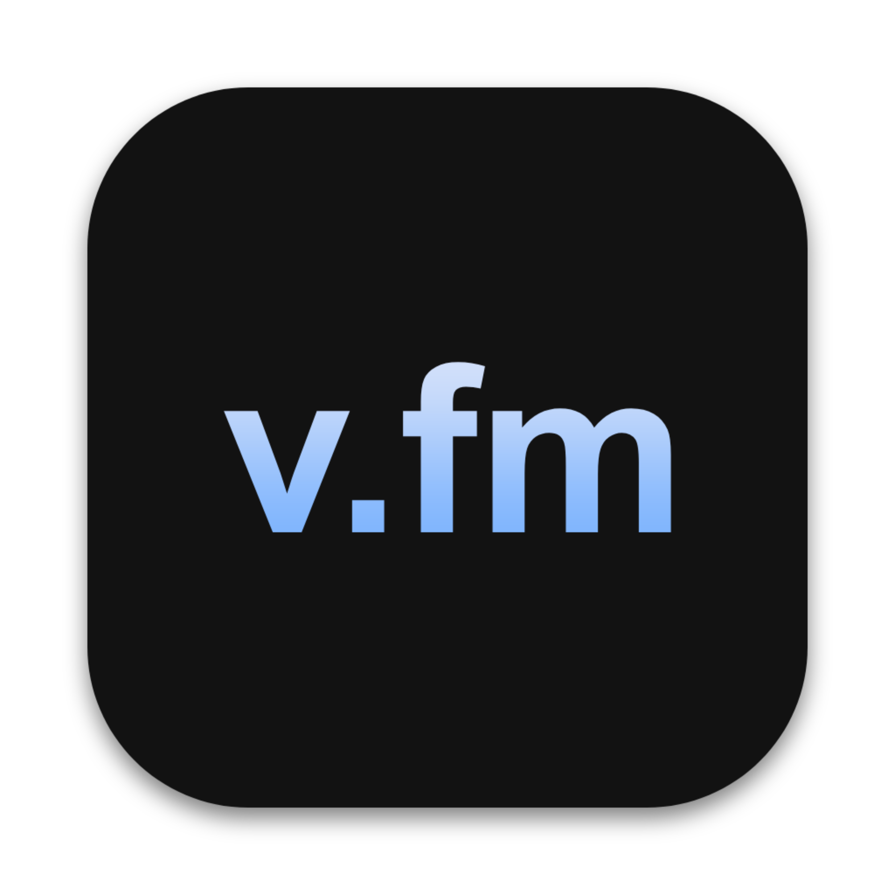

# video.fm



A desktop application that automatically creates personalized music video compilations based on your Last.fm listening history. Transform your music taste into shareable video content with just a few clicks.

## Features

- **Last.fm Integration**: Seamlessly enter the user of any Last.fm account to access its full listening history
- **Custom Compilations**: Create video compilations of your top songs for any given date period
- **Smart Video Selection**: Automatically searches for related music videos
- **Video Editing**: Replace specific videos during the creation process
- **Cross-platform**: Compatible with both macOS and Windows

# Note - macOS and Windows have separate branches

## Installation

### macOS
1. Download the latest `.dmg` file from the [Releases](https://github.com/yourusername/video-fm/releases) page or [videofm.app](https://videofm.app)
2. Open the DMG file and drag the application to your Applications folder
3. Right-click on the app and select "Open" to bypass macOS security warning on first launch
4. If you see a security warning, go to System Preferences → Security & Privacy → General and click "Open Anyway"
5. If none of the above worked, open Terminal and paste `xattr -cr /Applications/video.fm.app`
6. If that didn't open the app, paste `open /Applications/video.fm.app`

### Windows
1. Download the latest `.exe` installer from the [Releases](https://github.com/yourusername/video-fm/releases) page or [videofm.app](https://videofm.app)
2. Run the installer and follow the on-screen instructions
3. Launch the application from the Start menu or desktop shortcut
4. If SmartScreen shows a warning, click "More info" and "Run anyway"

### Regular Python Script [main branch] (Smoothest experience if you know what you are doing)
1. Download files in the main branch
2. Download ALL dependencies; can be found in requirements.txt
3. Make sure to have Python installed on your system
4. A text editor like VS Code can make running it easy
5. If you're on Windows, change the CODEC to `libx264`. If you have an NVIDIA GPU you can try `h264_nvenc`

## Usage

### Getting Started
1. Launch the video.fm application
2. Configure your API keys in the settings panel
3. Esnter your Last.fm username in the main field
4. Select the year and month for your compilation
5. Choose how many songs to include (1-50)
6. Check "Allow manual YouTube URL entry" if you want to provide specific video URLs from failed searches
7. Click "Generate" to start the compilation process

### Hardware acceleration coming later

## API Keys

This application requires two API keys to function properly:

1. **Last.fm API Key**:
   - Register at [Last.fm API](https://www.last.fm/api/account/create)
   - Click on "Create API account" and fill out the application form:
   - Application name: video.fm (or your anything). You can skip the rest
   - After submitting, you'll receive your API key immediately on the confirmation page
   - Copy this API key and paste it into the settings section of video.fm (gear icon)

2. **YouTube API Key**:
   - Go to [Google Cloud Console](https://console.cloud.google.com/) and sign in with your Google account
   - Click "Create Project" at the top of the page and name it (e.g., "video.fm")
   - Once your project is created, navigate to "APIs & Services" > "Library" in the left sidebar
   - Search for "YouTube Data API v3" and select it from the results
   - Click the "Enable" button to activate this API for your project
   - After enabling, go to "APIs & Services" > "Credentials" in the left sidebar
   - Click "Create Credentials" and select "API key" from the dropdown menu
   - Your new API key will be displayed - copy it to use in video.fm
   - Paste your API key into the video.fm settings screen (gear icon)

Helpful tutorial: https://www.youtube.com/watch?v=uz7dY8qTFJw

## System Requirements

- **Operating System**: macOS 10.13+ or Windows 10+
- **Memory**: 4GB RAM minimum, 8GB recommended
- **Disk Space**: 2GB+ free space (varies based on compilation length)
- **Internet**: Good internet connection
- **Dependencies**: FFmpeg (automatically downloaded if not present)

## Troubleshooting

### Common Issues

| Issue | Solution |
|-------|----------|
| No videos found | Verify your Last.fm username and time period |
| API quota exceeded | Get a new YT API key or wait next day |
| Low quality videos | Check your internet connection or manually provide URLs |
| Application crashes | Check console logs and ensure all dependencies are installed |
| Missing audio | Make sure FFmpeg is properly installed |
| File already exists. Replace y/N | Working on this, for now just try to delete or move video files you don't need |
| Issues with FFmpeg | Install manually or paste these into terminal (Mac): <br>sudo chmod +x /Applications/video.fm.app/Contents/Resources/extraResources/bin/ffmpeg<br>sudo chmod +x /Applications/video.fm.app/Contents/Resources/extraResources/bin/ffprobe |
| Command windows appearing (Windows) | This is normal behavior when processing videos |
| Temporary files not cleaning up | Restart the application or manually delete files in AppData/Local/video.fm |
| Video generation stuck | Cancel the process, clear cache, and try again with fewer songs |
| Cannot preview video | Bugged, just view it by clicking the file button |
| Slow video processing | Hardware acceleration is currently bugged |
| Installation issues on Windows | Make sure you have administrator privileges when installing |
| Path too long error (Windows) | Install the app in a directory with a shorter path |
| Videos not found for songs | Try the manual URL input option for rare or regional music |
| Can't pause video creation | Currently not supported - you'll need to stop and restart |

## Privacy

- All API keys and user preferences are stored locally on your device
- The application only communicates with Last.fm and YouTube APIs

## Development

### Building from Source & Setup requirements

#### Mac
```bash
# Clone repository (macOS branch)
git clone -b mac https://github.com/yourusername/video-fm.git
cd video-fm

# Install dependencies
npm install

# Run in development mode
npm start

# Setup requirements (before building)
# 1. Create a bundled-tools directory and add FFmpeg executables
mkdir -p bundled-tools
cp /path/to/ffmpeg bundled-tools/ffmpeg
cp /path/to/ffprobe bundled-tools/ffprobe
chmod +x bundled-tools/ffmpeg bundled-tools/ffprobe

# 2. Ensure you have compiled the Python executable with PyInstaller
pyinstaller videofm.spec

# Build for production
npm run dist:mac
```
#### Windows
```bash
# Clone repository (Windows branch)
git clone -b windows https://github.com/yourusername/video-fm.git
cd video-fm

# Install dependencies
npm install

# Run in development mode
npm start

# Setup requirements (before building)
# 1. Create a bundled-tools directory and add FFmpeg executables
mkdir bundled-tools
# Copy ffmpeg.exe and ffprobe.exe to the bundled-tools folder

# 2. Ensure you have compiled the Python executable with PyInstaller
pyinstaller videofm.spec

# Build for production
npm run dist:win
```

### Contributing
Contributions are welcome! Please check out the [Contributing Guide](https://github.com/fromis-9/video-fm/blob/main/CONTRIBUTING.md) for more information.

## License

[MIT License](LICENSE)

## Roadmap

- [ ] Custom video intro/outro options
- [ ] Additional video effects and transitions
- [ ] Year in review compilation feature
- [ ] Artist-specific compilations
- [ ] Export to various quality settings
- [ ] More

## Credits

- Last.fm for the listening history API
- yt-dlp
- FFmpeg for media processing
- Electron for the application framework

## Contact

- Discord: @fromis_09
